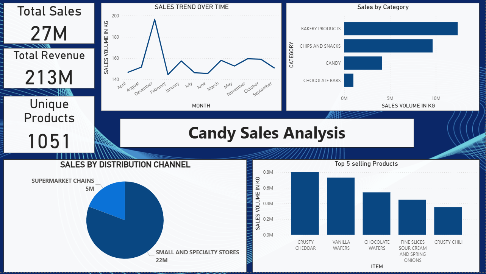

# Candy Sales Analysis Dashboard

## Overview

This project presents an interactive Power BI dashboard built to analyze candy sales data and generate meaningful business insights.

It focuses on transforming raw data into clear, decision-driven visualizations, helping stakeholders understand sales performance across products, categories, and distribution channels.

---

## Key Highlights

* Total Sales: 27 Million
* Total Revenue: 213 Million
* Unique Products: 1051

---

## Dashboard Insights

### Sales Performance

* Monthly sales trends highlight fluctuations and peak demand periods
* A noticeable spike in certain months suggests seasonal impact

### Category Analysis

* Bakery Products contribute the highest sales volume
* Chips & Snacks are the second strongest category
* Chocolate Bars contribute the least

### Product Analysis

Top-performing products include:

* Crusty Cheddar
* Vanilla Wafers
* Chocolate Wafers

### Distribution Insights

* Small & Specialty Stores contribute the majority of sales
* Supermarket Chains contribute a smaller share

---

## Tools and Technologies

* Power BI Desktop – Dashboard creation and visualization
* DAX (Data Analysis Expressions) – Measures and calculations
* Data Modeling – Relationships and transformations

---

## Dashboard Preview

---

## Important Note

The original dataset (CSV file) is not included due to accidental deletion.
However, the .pbix file contains the complete data model, enabling full interaction with the dashboard.

---

## Business Use Case

This dashboard can be used by:

* Sales teams to track performance
* Managers to identify top-performing products
* Businesses to optimize distribution strategies

---

## How to Run

1. Download the .pbix file
2. Open it using Power BI Desktop
3. Explore the dashboard and insights

---

## Project Value

* End-to-end data analytics project
* Interactive dashboard design
* Business-focused insights
* Portfolio-ready for Data Analyst roles

---

## Contact

For feedback or collaboration, feel free to connect.

---

If you find this project useful, consider starring the repository.
